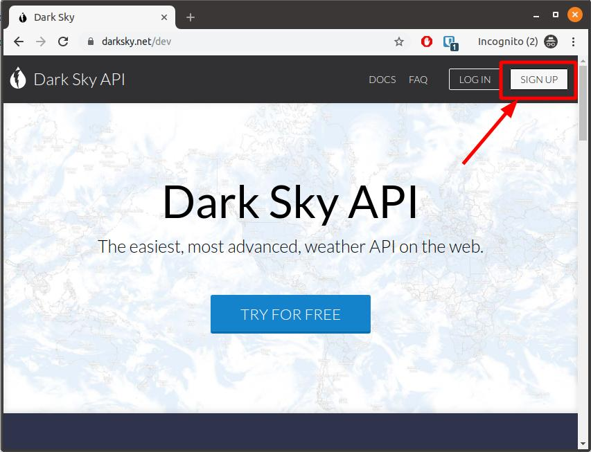
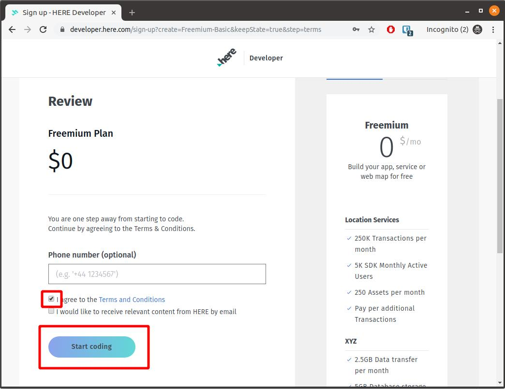
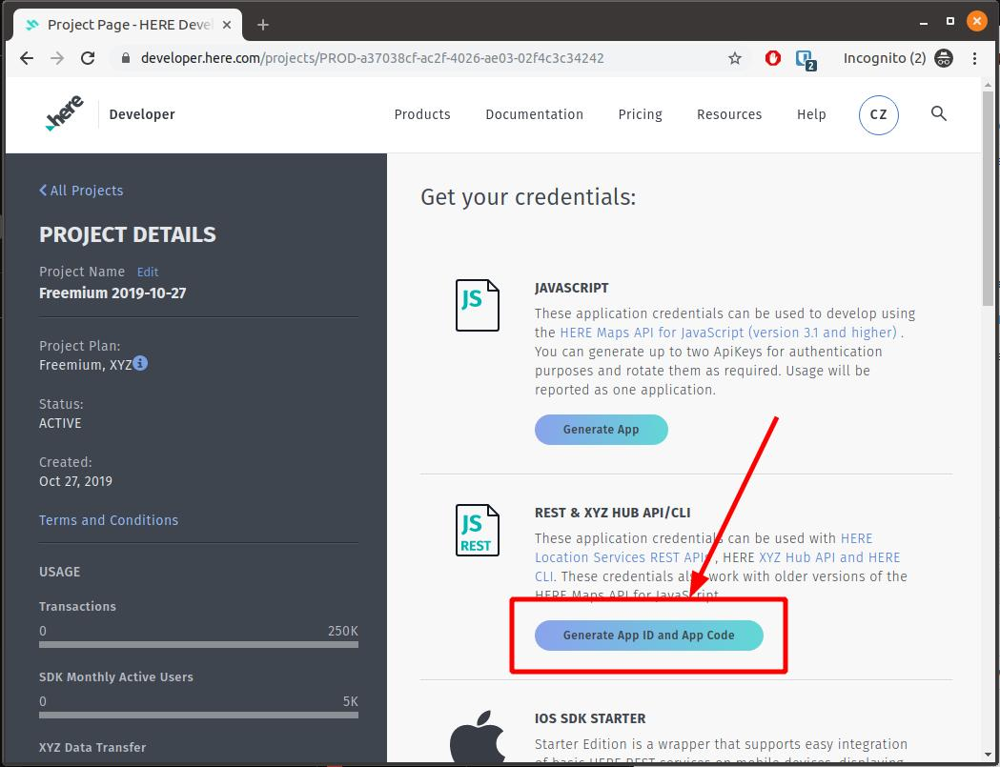

# 🤖 Module 2: APIs

In this module we will practice calling APIs.

When building a web application, you will most certainly need to call some APIs.

* **API** - **A**pplication **P**rogramming **I**nterface
* **REST** - **RE**presentational **S**tate **T**ransaction

**💡Tip: You can either test the APIs with Chrome or wth [Postman](https://www.getpostman.com/) (download from the instructor).**

## 1 Darksky weather ⛈ API

[Darksky](https://darksky.net) is website and mobile application providing weather forecasts.

Darksky also gives access to an [API](https://darksky.net/dev) we can use to get a 7 day weather forecast. The first 1000 requests per day are free!

### 1.1 Sign up for Darksky
1. Go to https://darksky.net/dev and signup for a new account.
   
1. Confirm your account with the email you received.
1. Login to your account

### 1.2 Call Darksky API
1. Test your account by clicking on the _Sample API Call_.
   1. Add `?lang=fr&units=si` to your _Sample API Call_ to set the language and units, the result should be URL similar to: https://api.darksky.net/forecast/YOUR_SECRET_KEY/37.8267,-122.4233?lang=fr&units=si
   1. The latitude and longitude of Annecy is: `45.89911,6.1287`, update your request to get the weather for Annecy.
  
   
1. Note your _Secret Key_ for later.

## 2 Here geocoding 🌐 API

The Darksky weather API accepts an exact latitude and longitude coordinate for the weather forecast. If we want to get the weather forecast for location, like `Annecy` or `Lyon`, we need a way to get the geographic latitude and longitude for locations. This is called **geocoding**.

[Here](https://www.here.com/) offers several location tools, including a **geocoding API**. With their freemium plan we can make 250000 requests per month for free.

### 2.1 Sign up for Here
1. Go to https://developer.here.com/sign-up?create=Freemium-Basic and signup a freemium account.
1. Accept the conditions and click _Start coding_.
   
1. Click the button _Generate App ID and App Code.
   
1. Once the keys are generated, copy the `APP ID` and `APP CODE`:
   

### 2.2 Call Here API
1. The [here geocode api documentation](https://developer.here.com/documentation/geocoder/topics/quick-start-geocode.html) shows how we can make an api request.
1. Open https://geocoder.api.here.com/6.2/geocode.json?app_id=YOUR_APP_ID&app_code=YOUR_APP_CODE&searchtext=annecy+france to see the geocode results for Annecy, France.
1. Look into the response to find the `NavigationPosition` `Latitude` and `Longitude`.

#### Exercise 2.1: What is the Latitude and Longitude of Lyon?

#### Exercise 2.2: What is the Latitude and Longitude of your home address?