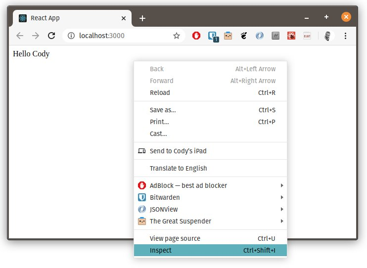

# Module 5 - React weather interface

⛈👀 See it live at [weather.cpinfo19.cecilecody.life](https://weather.cpinfo19.cecilecody.life)

## 1 What is React

React is a JavaScript library for creating the user interface ("view") based on web technologies (HTML). React _renders_ html from JavaScript.

## 2 What React is not

React **is not** a complete framework for creating a web application. React provides the tools for creating the user interface ("view") and does not include a framework for fetching the data ("model") or the logic for deciding what to display ("controller").

**Angular** is a compete framework for creating web applications. **React** is a library for rendering the user interface.

## 3 Prepare your express app

Use your express weather app from the previous course.

1. **⚠️ Change your express app to use port `4000`.** The react development server will use port `3000` so it must be free to avoid conflicts.

   At the top of the `app.js` file, change the code that starts your express server to use port `4000`. The code that starts express should resemble:

   ```javascript
   const app = express();
   const port = 4000;
   app.listen(port, () =>
     console.log(`Example app listening on port ${port}!`)
   );
   ```

1. Refactor your express server so that it has 2 routes:

   1. `/weather/:city` 👉 renders the pug template with the forecast
   1. `/api/weather/:city` 👉 returns the json weather data as json

   ☝️ The code to **1) fetch the geo-coordinates for a city** and 2) **fetch the forecast for the geo-coordinates** is the **same code** for both routes! Create a function that both express routes call.

   Remember, you can render a pug template with `res.render("tempate-name", data)` or send an object as json with `res.send(data)`.

   Your code should resemble the following:

   ```javascript
   // Weather rendered with pug template
   app.get("/weather/:city", async (req, res) => {
     try {
       const daily = await getWeather(req.params.city);
       res.render("weather", { daily });
     } catch (error) {
       console.error("An error occurred:", error.stack);
       res.status(500).send("Error!");
     }
   });

   // Weather API with JSON reponse
   app.get("/api/weather/:city", async (req, res) => {
     try {
       const daily = await getWeather(req.params.city);
       res.send(daily);
     } catch (error) {
       console.error("An error occurred:", error.stack);
       res.status(500).send("Error!");
     }
   });

   async function getWeather(city) {
     // 1. get geo-coordinates for city

     // 2. get daily weather for geo-coordinates

     return daily;
   }
   ```

1. Test your refactored express app in the browser and assure that both `/weather/annecy` and `/api/weather/annecy` both work.

   

## 4 Create a **new** app for the react weather app

1. From the **parent** directory of the `weather` project, create a **new** react project for the weather interface:

   ```cmd
   cd ..
   yarn create react-app weather-app
   ```

   You should now have 2 _separate_ projects:

   - `C:/` _(or wherever you created your project)_
     - `weather/`
       - `app.js`
       - `package.json`
       - `views`
         - `weather.pug`
       - ...
     - `weather-app/`
       - `package.json`
       - `src/`
         - `index.js`
         - ...
       - `public/`
         - ...
       - ...

1. Delete everything inside `weather-app/src`
   ```cmd
   cd weather-app
   cd src
   del *
   cd ..
   ```
1. Configure the proxy in `package.json` to hit the express app.

   Our react development server does not know about our express server running on port `4000`. We can [configure it to "proxy"](https://create-react-app.dev/docs/proxying-api-requests-in-development/) any unknown URLs to our express server.

   Inside `weather-app/package.json` add the following line (**add a comma depending on where you add the line**):

   ```json
   "proxy": "http://localhost:4000"
   ```

1. Add the file `weather-app/src/index.js`:

   ```jsx
   import React from "react";
   import ReactDOM from "react-dom";

   // YOUR CODE HERE

   ReactDOM.render(<App />, document.getElementById("root"));
   ```

## 5 Components

React allows us to organize our code into small reusable pieces called "components". Components are composed together to create complex user interfaces.

There several ways to write components. The traditional (pre 2019) way is a class based component that extends `React.component`:

```jsx
class ShoppingList extends React.Component {
  render() {
    return (
      <div className="shopping-list">
        <h1>Shopping List for {this.props.name}</h1>
        <ul>
          <li>Instagram</li>
          <li>WhatsApp</li>
          <li>Oculus</li>
        </ul>
      </div>
    );
  }
}

// Example usage: <ShoppingList name="Mark" />
```

**Components tell react what to render on the screen.**

A few important points:

- A component takes a parameter named `props` and returns a hierarchy of views to display to the user in the `render` method
- The `render` function returns a _description_ of what you want to see on the screen. React uses that description and displays the result.
- `render` actually returns a **React element**, however, most developers use JSX (the HTML looking tags in the above example)
- JSX mixes HTML syntax and JavaScript! Inside JSX we can put _any_ JavaScript inside `{ }` braces.
- React elements are JavaScript script objects that you store in variables and pass around inside your app.

The JSX compiler transforms return of the `render` function above example into this:

```javascript
return React.createElement(
  "div",
  { className: "shopping-list" },
  React.createElement("h1" /* ... h1 children ... */),
  React.createElement("ul" /* ... ul children ... */)
);
```

☝️ Here we are only rendering typical HTML elements (`<div>`, `<h1>`, etc.), but we can render other react components in the same way. For example we can now render the entire shopping list with `<ShoppingList />`. This is the magic of React!

## 6 Functional Components

While class components are very common, they require a lot of typing and have pitfalls around using the `this` pointer that require a extra care. The modern way to write components is using a function syntax, also known as **Functional Components**.

**For this course, we will use functional components.**

The above component can be simplified by using functional syntax:

```jsx
const ShoppingList = props => (
  <div className="shopping-list">
    <h1>Shopping List for {props.name}</h1>
    <ul>
      <li>Instagram</li>
      <li>WhatsApp</li>
      <li>Oculus</li>
    </ul>
  </div>
);
```

☝️ The above _functional_ syntax requires less typing and removes some of the strange problems involving `this`, since we don't use it!

## 7 Hello World

1. Inside `weather-app/src/index.js` add the following code:

   ```jsx
   import React from "react";
   import ReactDOM from "react-dom";

   const App = props => <div>Hello {props.name}</div>;

   ReactDOM.render(<App name="Cody" />, document.getElementById("root"));
   ```

1. In the terminal, inside the `weather-app` directory run:

   ```cmd
   yarn start
   ```

   The above command should open a window in Chrome with a single button.

   ⚠️ If Windows opens the Edge browser, open http://localhost:3000 in Chrome.

1. Inspect the html generated on the page (F12):

   

   

1. Install the [React Developer Tools for Chrome](https://chrome.google.com/webstore/detail/react-developer-tools/fmkadmapgofadopljbjfkapdkoienihi?hl=fr) and open the "React" tab in the developers tools.

   **If you cannot install the React Developer Tools for Chrome, use Firefox and install the [React Developer Tools for Firefox](https://addons.mozilla.org/en-US/firefox/addon/react-devtools/)**

1. Open the "React Components" tab in your developer tools:

   

#### Question 7.1: Inside the react dev tools, what happens if you change the property `name` in the App component?

## 8 Add search and forecast components

Next we will add the 2 components that will make up our app: `<SearchBar>` and `<Forecast>`.

1. Inside `weather-app/src/index.js`, above the `<App>` component, add a temporary placeholder for the city search. We will add input box and button later. For now, just add some text:

   ```jsx
   const SearchBar = () => <div>city search</div>;
   ```

   ☝️ Here we have simple component that renders some text inside two div tags.

1. Next add a component that will display the forecast:

   ```jsx
   const Forecast = props => (
     <div>
       {props.daily.data.map(day => (
         <p>
           {day.temperatureHigh} {day.summary}
         </p>
       ))}
     </div>
   );
   ```

   ☝️ This component has some new concepts:

   - 💡 React passes a single parameter to functional components. This parameter is most commonly named `props`, short for "properties". We will see later how we can pass data to components using properties.
   - 💡 As noted before, a component function returns JSX. JSX combines HTML like syntax with JavaScript inside `{ }` brackets.
   - The forecast component adds a `div` tag and then maps the daily data to return the date and max temperature surrounded by `p` tags.

1. Render the `<SearchBar>` and `<Forecast>` component inside the `<App>` component:

   Inside `weather-app/src/index.js`:

   ```jsx
   // const SearchBar = ...
   // const Forecast = ...

   const App = () => {
     const testData = {
       data: [
         { temperatureHigh: 10, summary: "cloudy and cold" },
         { temperatureHigh: 12, summary: "sunny and warm" }
       ]
     };
     return (
       <div>
         <SearchBar />
         <Forecast daily={testData} />
       </div>
     );
   };
   ```

   - Rather than returning JSX directly, we define some variables and an explicit `return` statement.
   - For now, we use some test data for the forecast. In the following step we will fetch the data from our express app.
   - Notice that we pass the test data to the Forecast component using `daily={testData}`. `daily` is the name of the property that the Forecast component expects and we set it to `testData` inside `{ }` brackets since it is defined in JavaScript.

1. Test your changes in Chrome, it should result the following:

   

## 8 Fetch the weather data from the express server

React components can be called (or "rendered") at any time (read about the lifecycle in the docs).

We have to tell react to only fetch our data the first time the App is is rendered. We also have to tell react that we want to store some data that should _only_ change when we, the programmer, want it to change.

To accomplish the above points, we use [react "hooks"](https://reactjs.org/docs/hooks-intro.html) to hook into the react framework. We will use 2 hooks:

- [`useEffect`](https://reactjs.org/docs/hooks-effect.html): tell react that we want to execute some code that could "effect" what is rendered. An example is calling our express server weather API.
- [`useState`](https://reactjs.org/docs/hooks-state.html): ask react to store some data for us and give use the ability to set and get that data. The data will remain the same until it gets set to something else. An example is the results of calling our weather API. Later, we will add a search box and button that will call the API and update the state.

1. Add [axios](https://github.com/axios/axios) to your react app. We previously used axios to call the here and Dark Sky APIs. We will now use axios to call _our_ express server weather API 🚀!

   From the `weather-app` directory, run:

   ```cmd
   yarn add axios
   ```

1. Fetch the weather data with a fixed city, i.e. `"Annecy"`.

   We configured our react development server to "proxy" any missing URLs to our express server. Make sure the server is running.

   In a **new terminal window**, inside the `weather` directory, start the express server if it is not running using `yarn dev` or `node app.js` depending if you added a "dev" script in the `package.json`.

1. Inside the `<App>` component, add a call to the `useState` hook to create "state" that will store the weather API results:

   In `weather-app/src/index.js`:

   ```jsx
   const App = () => {
     const [daily, setDaily] = useState({ data: [] });

     // ...
     // return ...
   };
   ```

   - Pass the default "empty" state to the `useState` function. This is modeled on what we expect our weather API to return: the **daily** weather object that contains an array, named `data`, that will contain the weather for each day.
   - `useState` returns an array containing two objects. The current value `daily` (initially the state we passed) and a function `setDaily` that can set the state.
   - ⚠️ Don't forget to add `useState` (and `useEffect` for later) to your imports. Modify the line `import React from 'react';` to:

     ```javascript
     import React, { useEffect, useState } from "react";
     ```

1. Add an `async` function into the `<App>` component that fetches the weather for a city.

   In `weather-app/src/index.js`:

   ```javascript
   const App = () => {
     const [daily, setDaily] = useState({ data: [] });

     async function searchCity(city) {
       const result = await axios(`/api/weather/${city}`);
       console.log("FETCH RESULT:", result.data);
       setDaily(result.data);
     }

     // ...
     // return ...
   };
   ```

   - Notice that we store the data into the state with the `setDaily` function.

   ⚠️ Don't forget to import `axios` in the top of your `index.js` file. You can import it with:

   ```javascript
   import axios from "axios";
   ```

1. Load the weather for a fixed city, "Annecy" for example.

   We can ask react to call a function when a component is rendered for the fist time with `useEffect(doSomething, [])`. The second parameter, the empty `[]` array tells react to call this function on the first time the component is rendered (or "mounted"). See the [documentation](https://reactjs.org/docs/hooks-reference.html#conditionally-firing-an-effect) for details.

   Inside `weather-app/src/index.js`, add the code to call our api on the first time the the `<App>` component is rendered:

   ```jsx
   const App = () => {
     const [daily, setDaily] = useState({ data: [] });

     async function searchCity(city) {
       const result = await axios(`/api/weather/${city}`);
       console.log("FETCH RESULT:", result.data);
       setDaily(result.data);
     }

     useEffect(() => {
       searchCity("Annecy");
     }, []);

     // ...
     // return ...
   };
   ```

   ☝️ React will now call our "effect" that searches for "Annecy" when the `<App>` is rendered the first time!

1. Test your changes in Chrome, it should result the following:

   

## 9 State Management

Managing state is a complicated task. Large projects often store the majority of the state in a single place, called "global state". [Redux](https://redux.js.org/) is a tool for managing state. [react-redux](https://react-redux.js.org/) is library to work with redux in React.

## 10 Build out the forecast component

#### Exercise 10.1: Using the work you did to create a beautiful forecast with the pug templates with the express server, complete the `<Forecast>` component to show the summary, date, min and max temperatures for each day.

💡 Hint: consider creating a separate `<Day>` component to simplify the code inside the `<Forecast>` component.

Find inspiration from [weather.cpinfo.cecilecody.life](https://weather.cpinfo19.cecilecody.life).

## 11 Add the search box

The application still does not yet allow us to search for a city.

Next we will add the search functionality that will allow us to call the api with a city entered by the user.

We will use an HTML `<form>` to combine multiple input elements into a single component.

In HTML, we would create a simple search bar like so:

```html
<form>
  <label>City:</label>
  <input type="text" />
  <button type="submit">Search</button>
</form>
```

1. Update the `<SearchBar>` component to render the above form:

   Inside `weather-app/src/index.js`:

   ```jsx
   const SearchBar = () => (
     <form>
       <label>City:</label>
       <input type="text" />
       <button type="submit">Search</button>
     </form>
   );
   ```

   ☝️ The above form will refresh the page when the Search button is clicked. We will use react to "control" the form instead.

   With react, we create a [controlled form](https://reactjs.org/docs/forms.html) by storing the input values in state and binding JavaScript events to code in our components.

   ```jsx
   const SearchBar = () => {
     const [city, setCity] = useState("");

     function handleCityChange(event) {
       setCity(event.target.value);
     }

     function handleSubmit(event) {
       event.preventDefault();
       console.log("Searching for:", city);
     }

     return (
       <form onSubmit={handleSubmit}>
         <label>City:</label>
         <input type="text" value={city} onChange={handleCityChange} />
         <button type="submit">Search</button>
       </form>
     );
   };
   ```

   - Notice we bind the input `value` and `onChange` properties to our state and a handler function that sets the state.
   - We also write our event handler for the forms `onSubmit` event. This handler doesn't do anything useful for now. It also calls `preventDefault()` to avoid the page refreshing when the user clicks on the Search button.

1. Test the `SearchBar` in Chrome. Note that the search value is logged to the developer tools console.

#### Exercise 11.1: Connect the `searchCity()` function in the `<App>` component to the `<SearchBar>` `onSubmit` handler.

💡 Hint: _pass_ the `searchCity` function as a **property** to the `<SearchBar>` component.

⚠️ Warning: be sure to remove `useEffect()` from the `<App>` component once the search bar is working.

#### Bonus 11.2: It is also possible to "automatically" search as the user types. Modify the `<SearchBar>` to eliminate the need for the user to click on the Search button.

See [weather.cpinfo19.cecilecody.life](https://weather.cpinfo19.cecilecody.life) for an example.

💡 Hint: the package [`use-debounce`](https://github.com/xnimorz/use-debounce) provides an excellent implementation that delays (or "debounces") changes until the user _stops_ typing for 1000 ms. See the [Debounced Callbacks](https://github.com/xnimorz/use-debounce#debounced-callbacks) documentation.

#### Bonus 11.3: Give the user the option to change the forecast language.

#### Bonus 11.4 Give the user the option to change the forecast units (Celsius vs Fahrenheit).

## 12 Multiple pages

Our application only contains a single page. There are multiple ways to use react with applications that present multiple pages to the user.

### Static Site

[Gatsby.js](https://www.gatsbyjs.org/) is a framework that allows building multiple pages with react that can all be stored on a static web server. Each page works independently, the same way a traditional webserver works. A static site is typically the fastest way to load a usable page for users. However, there is typically no client side "state" that can be passed between pages.

### Client Side Routing

[React-router](https://reacttraining.com/react-router/web/guides/quick-start) allows rendering different components based on the current URL. While technically there is only one page loaded, components and the URL can change as the user clicks on links on the page. This is known as "client side routing". Client side routing often can display a "loading" screen faster than server side rending. Even if the entire time it takes to load a page is longer, the user "feels" like the page is fast.

### Server side rendering

[Next.js](https://nextjs.org/) allows **server side rendering** where pages can be rendered on a server (similar to static sites) _and_ routing can be done on the client. This requires a server that can render pages dynamically on demand. The advantage to server side rendering is that servers often have more resources available than clients and the time that a page is completely rendered for the user can be faster.

#### Bonus 12.1: Use one of the above tools to add a recent cities page (remember to store the recent cities in cloud firestore). Allow navigating between the recent cities and a forecast page.
